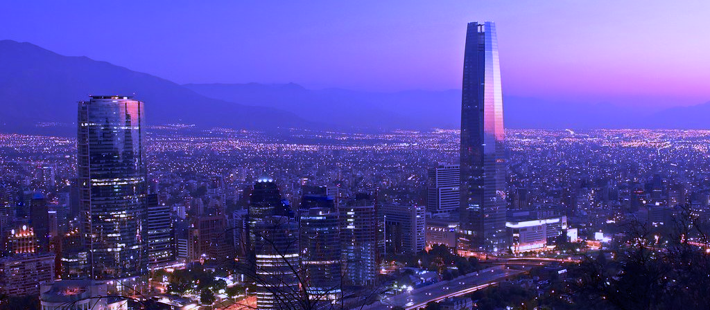
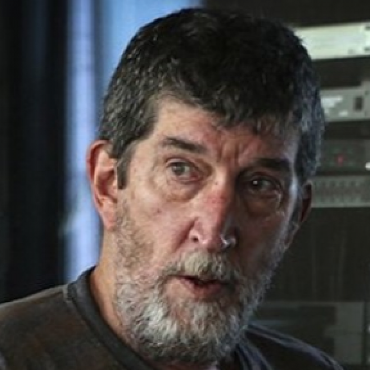

Para enviar sus ponencias, por favor utilice el [siguiente formulario](https://forms.gle/yxWrVJH9FsRUjAwD9)

### [**Descarga el programa del Congreso**](Programa_preliminar.pdf)

---

> La comunidad de la Ciencia Política latinoamericana ha vivido un periodo de grandes dificultades en los últimos tiempos. En un contexto regional convulsionado por movilizaciones populares e inestabilidad política, irrumpió la pandemia de Covid-19 agregando incertidumbre, dificultades económicas y consecuencias sociales negativas. En el caso de ALACIP, luego de nuestro congreso en Monterrey, buscamos adaptarnos a la nueva situación. Por un lado, acordamos postergar la realización del congreso previsto para 2021 en Santiago de Chile. Pero, al mismo tiempo, buscamos aprovechar el uso creciente de las tecnologías de la comunicación para mantener activa a la asociación y reforzar el vínculo con nuestra comunidad a través de diversas actividades on-line. Los tiempos difíciles constituyen desafíos que, cuando son adecuadamente enfrentados, pueden resultar en avances que nos llevan a escalones superiores de nuestra actividad.
> 
> Pero nuestro objetivo siempre ha sido recuperar la interacción física que, con su insustituible riqueza, favorece el desarrollo de nuestra disciplina, ahora combinada con las herramientas virtuales. Poco a poco la actividad académica ha ido reincorporando la presencialidad en nuestra región, aunque, lamentablemente, el proceso ha sido lento y heterogéneo. En particular este congreso, que resolvimos realizar de forma virtual, responde al nivel de incertidumbre sobre las posibilidades de la presencialidad al momento de tener que tomar la decisión y a las nuevas posibilidades que nos brindan las plataformas digitales. A pesar de las limitaciones que implica, confiamos plenamente en que tendremos un gran congreso latinoamericano de ciencia política 20 años después de nuestra fundación, que colocará un nuevo mojón en nuestro indetenible camino para promover una ciencia política de calidad y comprometida con la democracia y el bienestar social en nuestra región.

**Daniel Buquet**  
Secretario General ALACIP

---

> Finalmente nos volvemos a encontrar. Luego de años difíciles en el mundo, nuestras disciplinas se han vuelto más relevantes que nunca. La pandemia y sus consecuencias han puesto en jaque a nuestras frágiles institucionalidades políticas, exigiendo soluciones que van más allá de la simple gestión. La política, si es que alguna vez dejó de serlo, volvió a tomar un rol clave en la comprensión y solución de nuestros problemas actuales. Hoy, enfrentados a preguntas como el (re)surgimiento de los populismos, los debates sobre el rol del colonialismo, las preguntas sobre el sentido de las instituciones o la relevancia de la emergencia climática, tenemos la oportunidad de volver a juntarnos a compartir nuestros análisis y propuestas.
> 
> Nos hubiese encantado recibirlos en Santiago, teníamos un plan armado de actividades para recuperar la anhelada presencialidad. Pero nos ganó la cautela (y en buena hora). Al momento de celebrar este congreso, las infecciones vuelven a subir y nos estamos preguntando si seremos capaces de afrontar nuevas olas de restricciones y precauciones. Pero eso no nos debe desanimar. Las plataformas tecnológicas, con todas sus limitaciones, le han abierto la puerta a académicos y académicas de todo el mundo a acceder a posibilidades de conexión y trabajo conjunto que antes eran inalcanzables. Las conferencias en línea han reducido barreras económicas y de distancia, por lo que esperamos ver esa diversidad reflejada en las más de 400 mesas del congreso.
> 
> A nombre de la Asociación Chilena de Ciencia Política, les damos la bienvenida al XI Congreso Latinoamericano de Ciencia Política. Esperamos que puedan compartir, conversar y aprender del increíble desarrollo de nuestras disciplinas en el continente y más allá.

**Javier Sajuria**  
Presidente ACCP
